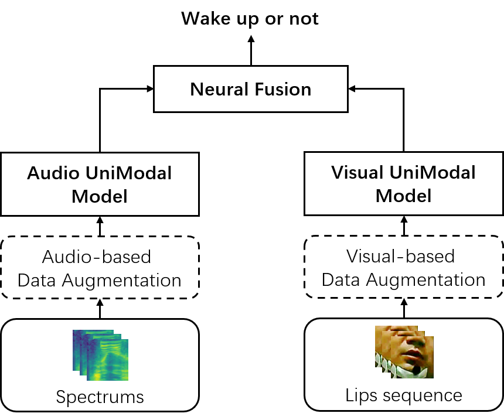

# Audio-Visual Wake Word Spotting using HMAFusion-SimAM-ResNet

The official related resource of our submitted ICASSP paper "The DKU Post-Challenge Audio-Visual Wake Word Spotting System for the 2021 MISP Challenge: Deep Analysis".

## Authors

Haoxu Wang, Ming Cheng, Qiang Fu, Ming Li

## Content

### abstract

This paper further explores our previous wake word spotting system ranked 2-nd in Track 1 of the MISP Challenge 2021. First, we investigate a robust unimodal approach based on 3D and 2D convolution and adopt the simple attention module (SimAM) for our system to improve performance. Second, we explore different combinations of data augmentation methods for better performance. Finally, we study the fusion strategies, including score-level, cascaded and neural fusion. Our proposed multimodal system leverages multimodal features and uses the complementary visual information to mitigate the performance degradation of audio-only systems in complex acoustic scenarios. Our system obtains a false reject rate of 2.15% and a false alarm rate of 3.44% in the evaluation set of the competition database, which achieves the new state-of-the-art performance by 21% relative improvement compared to previous systems. Related resource can be found at: https://github.com/Mashiro009/DKU_WWS_MISP.

<p align="center">

</p>

## Experiments

### Preprocess for lip-region video

This work only considers the lip regions of the video as model input.

1. We use the [RetinaFace](https://github.com/serengil/retinaface) face detector extracts all face images and the corresponding 5 facial landmarks in each video.  
2. We use the K-means algorithm in Scikit-learn to cluster faces of the same person in one given video based on the sequential coordinates of the detected faces since we assume that a talking face will not move dramatically in a short time window.
3. We use the [ArcFace](https://github.com/serengil/retinaface) face recognizer to select the target speakers from pairwise mid-field videos that only have one identity in each video since the far-field wide-angle video may contain multiple people while only one is the target speaker.
4. Now we have the target speaker face squence and face landmarks of both middle-field and far-field. Then we crop the lip regions based on the landmarks according to [url](https://ieeexplore.ieee.org/document/9747216/). Finally, we get extracted lip-region video for each utterance.

### Preprocess for audio, video dataset

Please prepare `eval_far_v1, eval_lips_video_v1` dir in `mispdataset` dir.

For audio dataset `eval_far_v1`, we prepare kaldi-liked `wav.scp, text`, and a wavid-to-uttid file `utt2ref` because each utterance corresponds to many domains and many channels audio waves.
```
## wav.scp
0_0 ~/misp/eval_data/audio/positive/audio/eval/far/0/0.wav # first channel of utt 0
0_1 ~/misp/eval_data/audio/positive/audio/eval/far/0/1.wav # second channel of utt 0
9_0 ~/misp/eval_data/audio/negative/audio/eval/far/9/0.wav # first channel of utt 9

## text
0_0 XIAOTXIAOT
0_1 XIAOTXIAOT
9_0 FREETEXT

## utt2ref
0_0 0
0_1 0
9_0 9
```


For video dataset `eval_lips_video_v1`, we prepare kaldi-liked `lip.scp, text`, and a lipid-to-uttid file `utt2ref`.
```
## lip.scp
0 ~/misp/eval_data/video/positive/video/eval/far/0/speaker/lips.avi # lip region video of the target speaker of utt 0
9 ~/misp/eval_data/video/negative/video/eval/far/9/speaker/lips.avi # lip region video of the target speaker of utt 9

## text
0 XIAOTXIAOT
9 FREETEXT

## utt2ref
0 0
9 9
```

### Evaluation

```
./run.sh
```

### Checkpoint

| model                  | dev-frr | dev-far | dev-wws | eval-frr | eval-far | eval-wws |  url   |
| :---:                  | :----:  |  :---:  | :---:   | :---:    | :---:    | :---:    | :---:  |
| HMAFusion-SimAM-ResNet | 3.04    |  2.55   | 5.59    | 2.15     | 3.44     |   5.59   | [baiduyun](https://pan.baidu.com/s/18H9iV4pGUAKqYoYaa15AQw?pwd=3562), [google drive](https://drive.google.com/file/d/1p3SbtbRly7j3NilPhdDJG0kv9ROOue2K/view?usp=sharing)  |

## Citation

## License


## Contact

If you have any suggestion or question, you can contact us by: ming.li369@dukekunshan.edu.cn. Thanks for your attention!